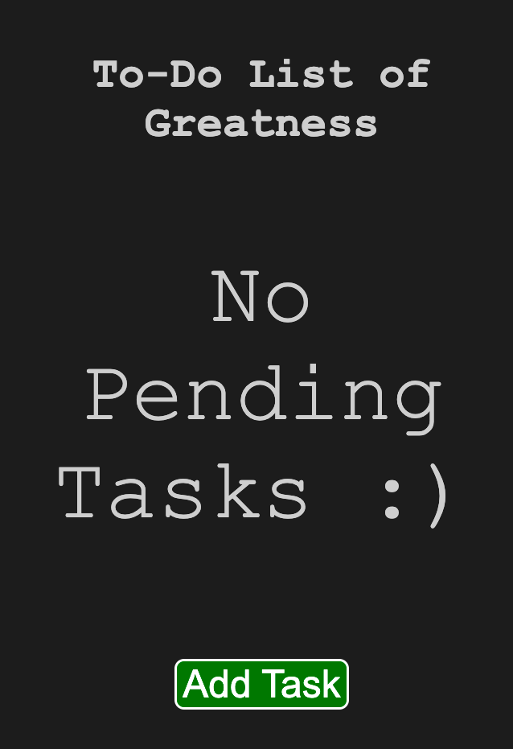
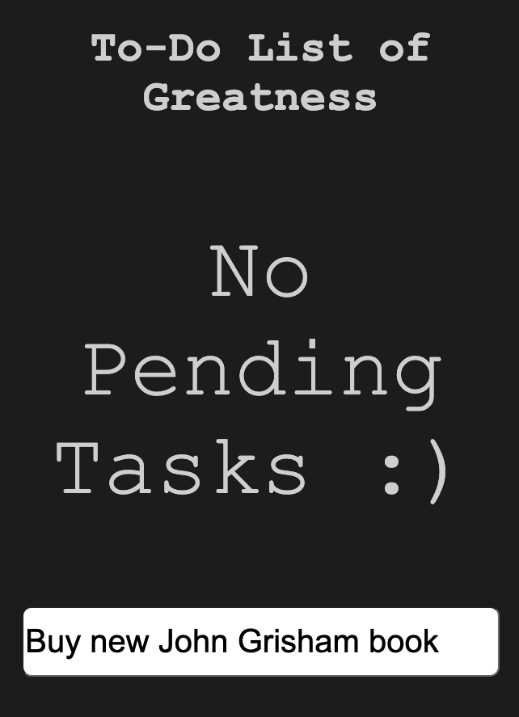
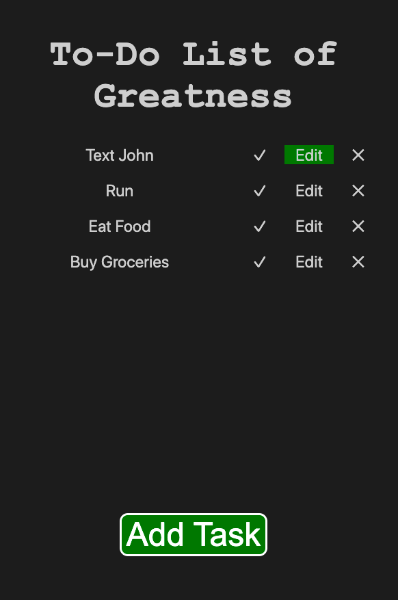
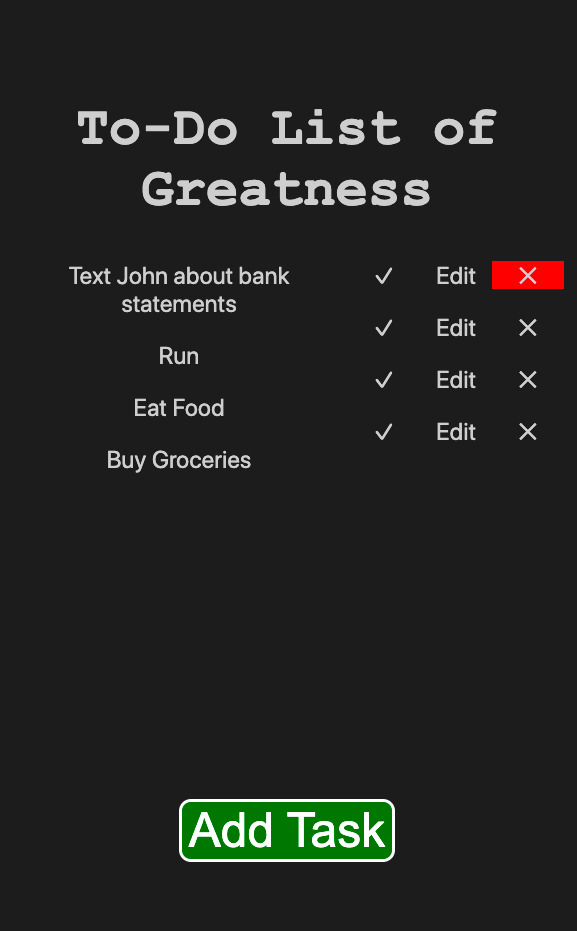
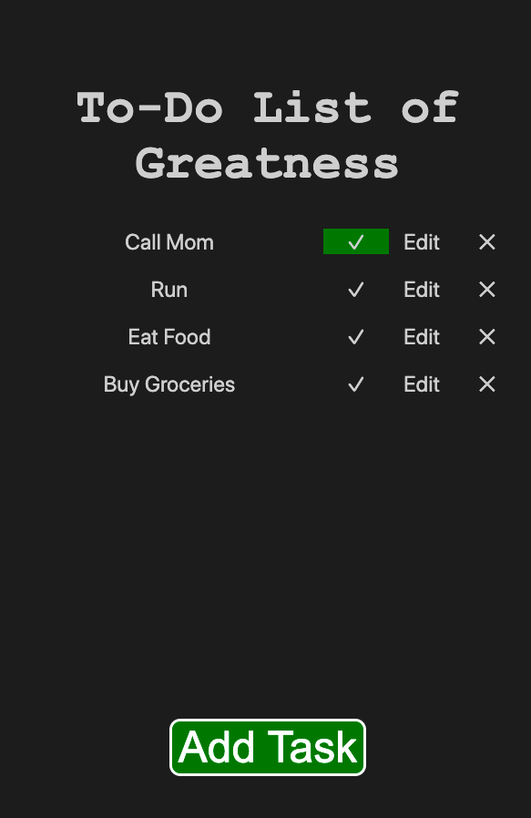
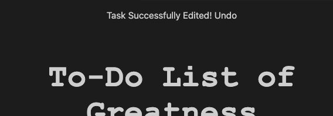
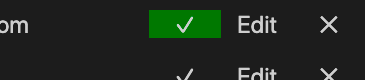

### Design Decisions and Final Designs
- "Add Task" button
    Link to Image: 
    - Included a button at the bottom of the page that allows a user to add a task to their to-do list.
    - The button was placed at the bottom of the screen in order to be closer to the users' thumbs, allowing them to add a task without having to change their grip.
    - The button is green in order to draw attention to itself, and the color green provides a connotation of adding something.
    - Similarly, the button was made to look "clickable" by having rounded edges, resembling physical buttons people interact with daily.
    - No other unselected buttons have colors in order to draw attention to this button, and also because we feel as though the buttons "✓," "✕," "Edit," and "Undo" are symbols/words that are universally recognized in their function thanks to other popular applications (e.g. email).

    - After selecting the Add Task button, the “Add Task" button goes away and the keyboard is opened, where the user can type out their task and submit it by clicking “Return” or “Done” on their phone's keyboard:
    Link to Image: 
    
- "Edit" task button:
    Link to Image: 
    - Decided against highlighting the entire task, as this might imply that the actual text of the task is clickable.
        - Made selecting the "Edit" button green, and decided against using another color as we felt that there was no third color that could be directly associated with the function of editing.
        - We decided that, upon clicking the "Edit" button, having the existing text from a task auto populate in the "Edit Task” text field is sufficient for the user to understand which task they are actively editing.
        - The keyboard popping up also helps user know they are actively editing their to-do list/selected task.

- "Delete" task button:
    Link to Image: 
    - Made selecting the “X” button red. The reason for this is that in other apps the color red typically implies that something is being removed, and we wanted to distinguish the feedback received from deleting a task from that of completing a task.

- "Complete" task button:
    Link to Image: 
    - Made selecting the "✓" button green. The reason for this is that the color green typically carries a connotation of completion and growth, creating a rewarding feeling for the user.

- "Task Successfully Added! Undo," "Task Successfully Completed! Undo," "Task Successfully Deleted! Undo"
    Link to Image: 
    - Added this confirmation feature so that users can get feedback that the program is working as intended.
    - Moved to the top of the page because thumb-area/bottom of screen is focused on adding new tasks.
    - Added "Undo" button to provide flexibility for the user in case they wish to undo their actions.
    - Did not make the "Undo" button draw as much attention as the other buttons because it is not as central to the function of the to-do list as the other buttons are.

- Ordering of the “Complete,” “Edit” and “Delete” buttons
    Link to Image: 
    - Rearranged order from “Complete, Delete, Edit” to “Complete, Edit, Delete” to add a natural barrier between the “Complete” (positive task) and “Delete” (never completed, no longer relevant, negative connotation).
    - Additionally, it acts as prevention system for misclicks, as if the user tries to press "✓" and hits "Edit," they can simply exit out of the keyboard that pops up. The same thing applies for if a user tries to press "X" but presses "Edit" instead.

### Alternative designs we considered

- As we can see in the png above, this iteration of the design most closely resembles our final design. We considered having a form at the bottom of the page that would allow the user to assign a color to the task based on its "Priority" (i.e. red is most urgent, yellow is not as urgent, and green is not urgent). However, we wanted to make our to-do list simplistic and easy as possible to navigate, and felt like these added colors would be confusing in conjunction with the colors used for the feedback from selecting buttons.
- Additionally, as can be seen about two thirds of the way down and to the right of the screen, we considered including a pen/pencil to mean edit the task. Upon reflection, however, we felt that this symbol was not as universal of a signifier as a checkmark or X, and so we opted to write "Edit" instead.
- We did not end up having borders for our tasks or buttons related to a created task because we felt that it made the page look cluttered. Additionally, we felt as though "✓," "✕," "Edit," and "Undo" were universal enough such that people would recognize them as clickable, so we didn't border them.

### User Interview
  - User tested the white border for the submit button.
    - User preferred the white border and the green background, and mentioned that the button "reminded them of highway signs" in a positive, action-provoking way.
  - User tested the lack of borders around the complete, edit, and delete buttons.
    - It wasn’t a problem for them, as they knew what buttons to press.